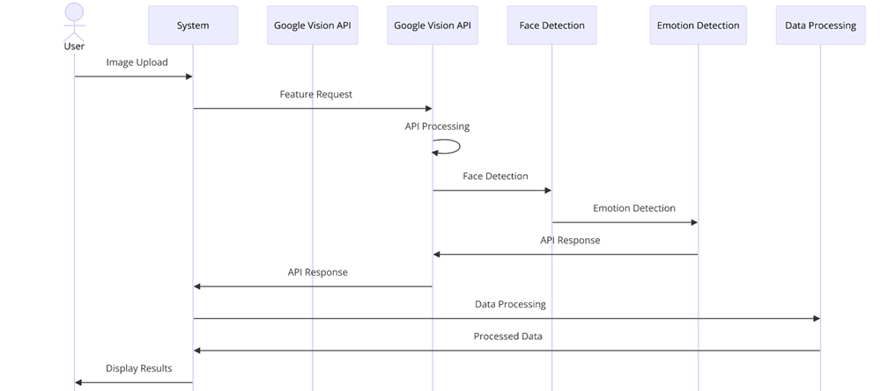
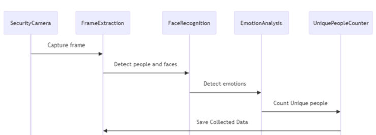
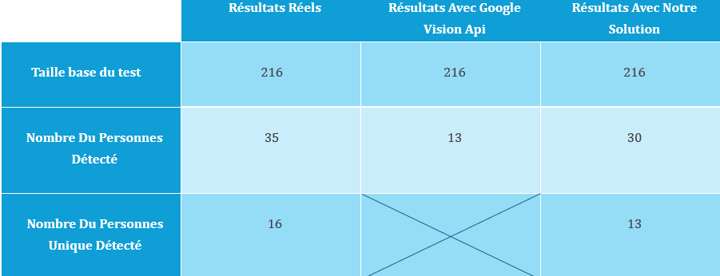

# 👁️‍🗨️ Person Detection with Emotion Recognition in Public Spaces Using Google Cloud Vision API 🌐

## 📝 Overview
This project utilizes the Google Vision API and advanced image processing algorithms to detect faces and analyze emotions in images captured by a security camera. The system processes data to provide actionable insights, such as the count of unique individuals and their emotional states. 

---

## 🚀 Our Solution
### Key Steps:
- 📸 **Image Capture**: A security camera captures real-time images.
- 🖼️ **Frame Extraction**: Frames are extracted to detect individuals and faces.
- 😃 **Emotion Analysis**: Faces are analyzed to detect emotions.
- 🔢 **Unique Person Count**: The system calculates the number of distinct individuals across images.

---

## 🛠️ Software Environment

### 🖥️ Development Tools
- 🐍 **Anaconda**: For Python environment management and package installation.
- 📓 **Jupyter Notebook**: Interactive code development and documentation.

### 🔧 Technologies Used
- **Python**: Core language for project implementation.
- 🖼️ **OpenCV (cv2)**: Handles image processing and computer vision tasks.
- 🤖 **Ultralytics YOLO**: Enables real-time object detection.
- 🙂 **MTCNN**: Detects faces in images.
- 👤 **FaceNetPyTorch**: Extracts facial features for person identification.
- 🧠 **DeepFace**: Analyzes facial emotions and ensures facial uniqueness.
- 📋 **Google Vision API**: For object recognition, face detection, and OCR.
- 🧮 Libraries like **numpy** and **shutil** for numerical operations and file management.

---

## 🔍 Development Details

### 🔗 System Integration
During development, the system was connected to a surveillance camera to:
1. 🎥 Capture real-time video streams and extract frames.
2. 🛠️ Detect individuals and analyze their emotions.
3. 🧮 Count unique individuals across multiple frames.

### 🧩 Key Processes
#### 1️⃣ Frame Extraction from Camera
Captures and crops images from the camera's region of interest (ROI), ensuring only valid and non-empty frames are saved.

**File:** `extract.py`

#### 2️⃣ Using Google Cloud Vision API
Processes images to detect people and their emotions, saving results with filenames indicating the dominant emotion.

**File:** `GoocglecloudAPI.py`

#### 3️⃣ Emotion Detection and Person Counting
- **Face Detection and Emotion Analysis:** YOLO and MTCNN detect faces, while DeepFace analyzes emotions.
  - **File:** `FaceDetectionemotion.py`
- **Unique Person Counting:** MTCNN and InceptionResnetV1 identify unique individuals by comparing facial embeddings.
  - **File:** `estmatinguniquepeoplecount.py`

---

## 📊 Testing and Validation
Our solution showed improved performance compared to the Google Vision API in specific tests, demonstrating robustness under various conditions.

---

## 📂 File Structure
- 📁 **`Media/ConceptionArchitecture.png`**: System architecture diagram.
- 📁 **`Media/ConceptionSolution.png`**: Solution design illustration.
- 📁 **`Media/Tests.png`**: Test and validation results.
- 📄 **`extract.py`**: Script for extracting frames from the camera.
- 📄 **`GoocglecloudAPI.py`**: Script utilizing the Google Cloud Vision API.
- 📄 **`FaceDetectionemotion.py`**: Script for face detection and emotion analysis.
- 📄 **`estmatinguniquepeoplecount.py`**: Script for counting unique individuals.

---

